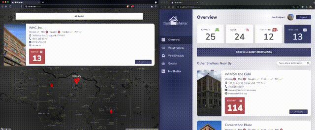
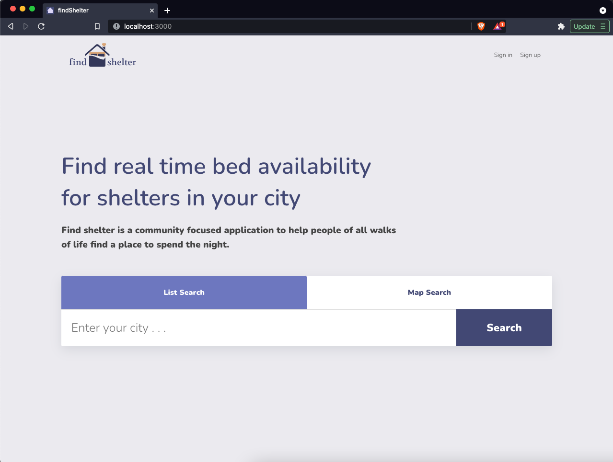
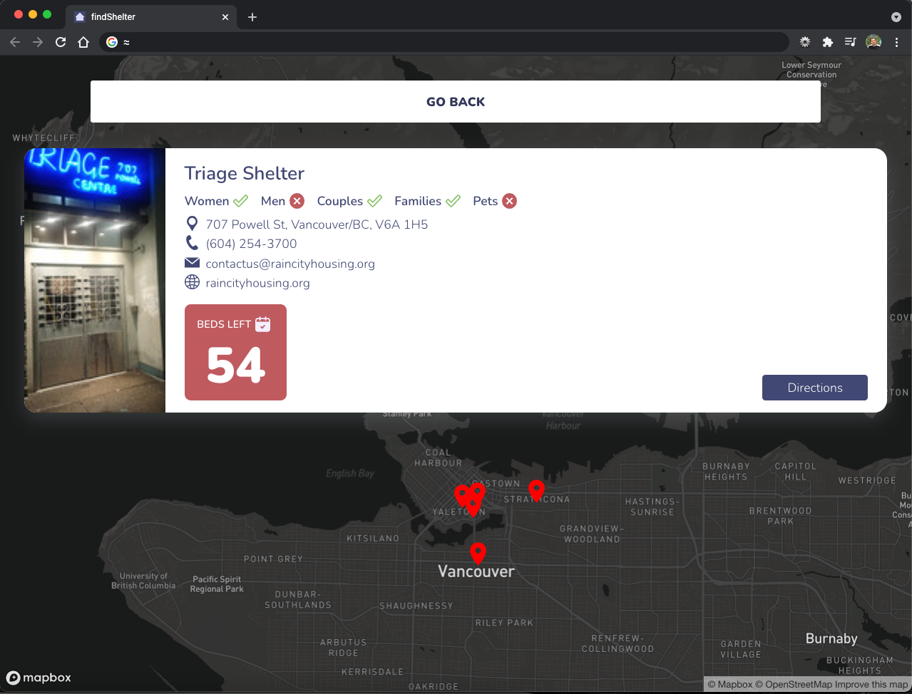
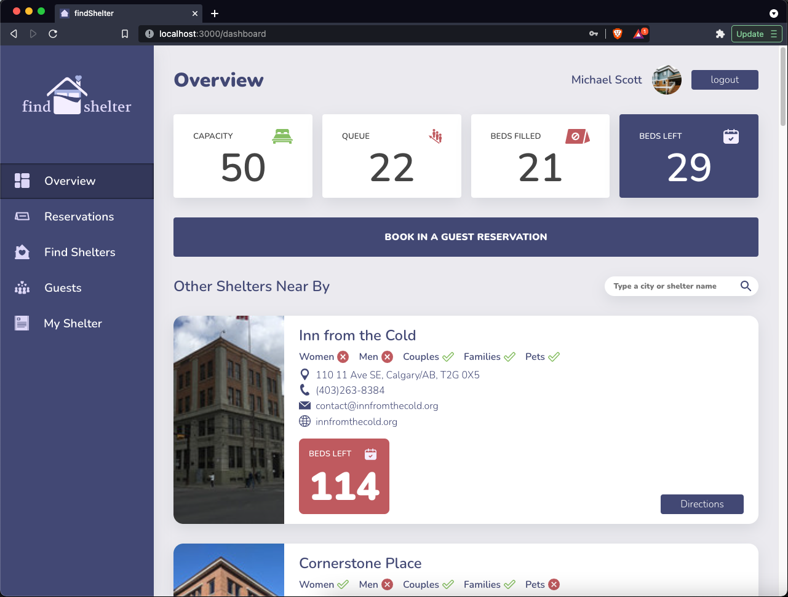
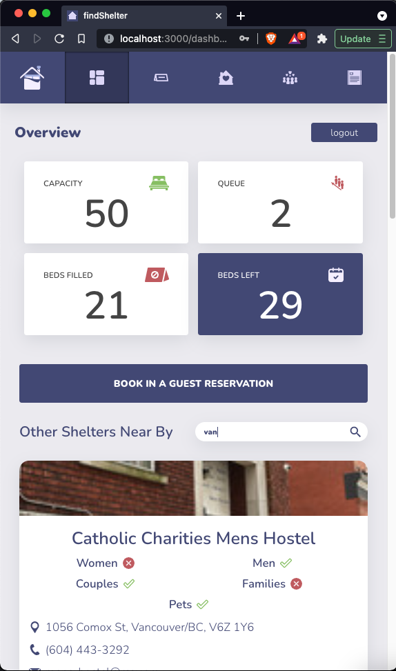
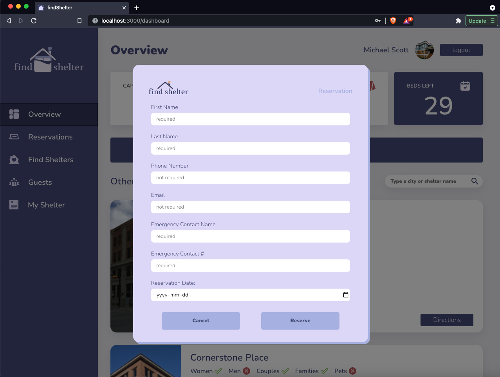
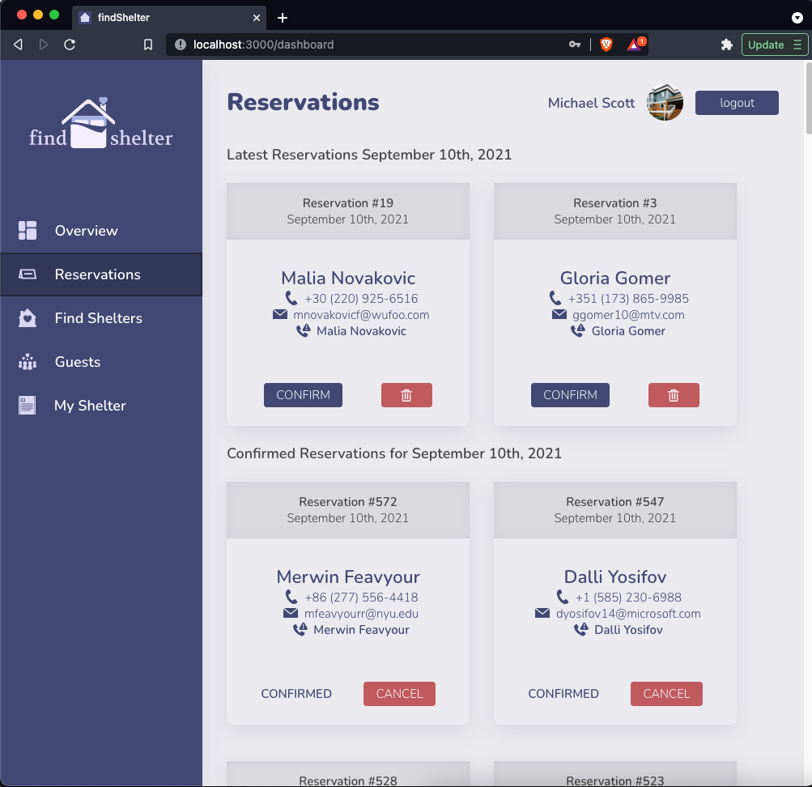

# Find shelter

- [About](#about)
- [Final product](#final-product)
- [Installation](#installation)
- [Usage](#usage)
- [Dependencies](#dependencies)
- [Development dependencies](#development-dependencies)

---

## About

Find shelter is a community focused application to help people of all walks of life find a place to spend the night.
- Front End: TypeScript, React, MapBox, Styled Components and SASS
- Back-End: Socket IO, Node and Express with TypeScript
- Database: PostgresQL and ElephantSQL

---

## Final product

#### View of the project

Real-time reservations


Index


Map View


Dashboard


Mobile


Book reservation


Reservations


---

## Installation

Create the PostgreSQL database (these instructions may need to be adapted for your operating system):

```shell
psql
CREATE DATABASE find-shelter;
\q
```

Update dbparams.ts to connect with your local PostgreSQL set up.

Create a .env file in the server directory and the information of the database

```
DB_HOST=localhost
DB_USER=user_name
DB_PASS=password
DB_NAME=db_name
DB_PORT=port
DB_URL=
```

Clone the repository:
```shell
git clone git@github.com:ricardowgomes/findShelter.git
```

Install all the dependencies::

In the server folder, install dependencies and then seed the database:

```shell
cd server
npm install
npm run db:reset
```

In the client folder, install dependencies:

```shell
cd client
npm install
```

The app also requires the a [PostgreSQL](https://www.postgresql.org/) database set up and running.

---


## Usage

Start the server with:
```shell
npm run dev:server
```

Start the client side with:
```shell
npm start
```

The development server will automatically open a browser at http://localhost:8000/ with the app running.

---


## Dependencies

- [React](https://reactjs.org/)
- [axios](https://www.npmjs.com/package/axios)
- [classnames](https://www.npmjs.com/package/classnames)
- [React Map GL](https://visgl.github.io/react-map-gl/)
- [Socket.io](https://socket.io/)
- [date-fns](https://date-fns.org/)
- [lodash.debounce](https://lodash.com/docs/4.17.15)
- [express](https://expressjs.com/)
- [pg-native](https://www.npmjs.com/package/pg-native)
- [bcryptjs](https://www.npmjs.com/package/bcryptjs)

## Development dependencies

- [Babel](https://babeljs.io/)
- [TypeScript](https://www.typescriptlang.org/)
- [ts-node](https://www.npmjs.com/package/ts-node?activeTab=versions)
- [node-sass](https://www.npmjs.com/package/node-sass)
- [styled-components](https://styled-components.com/)